# 📐 Balconcito ERP - Diagramas Arquitectura

Este documento contiene diagramas visuales del sistema en formato Mermaid.

---

## 🗄️ Diagrama Entidad-Relación (ERD)

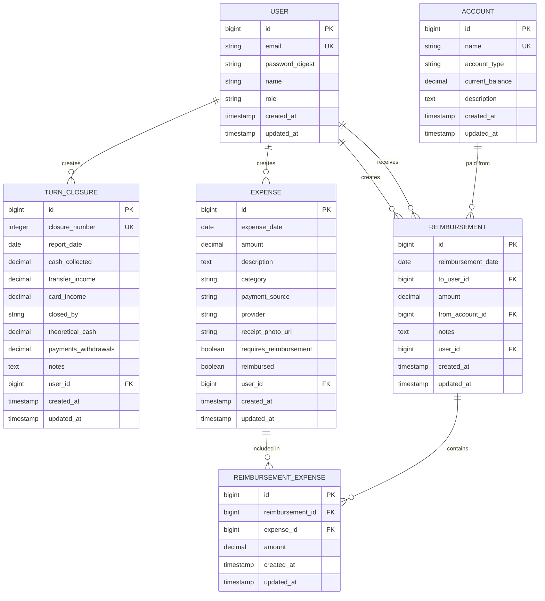

---

## 🔄 Flujo: Registrar Cierre de Turno

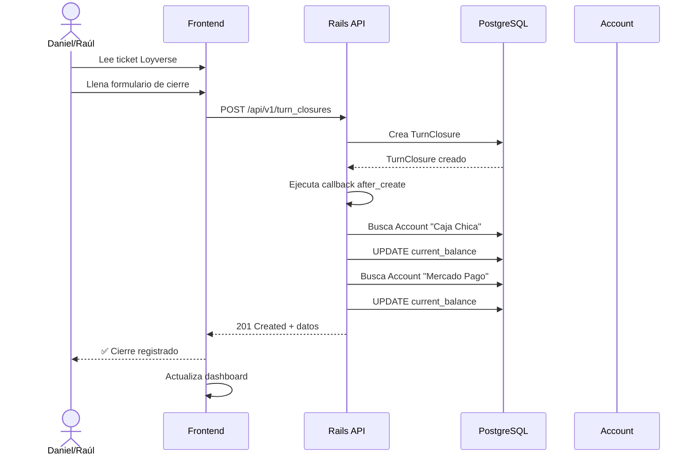

---

## 💸 Flujo: Registrar Gasto (Efectivo del Negocio)

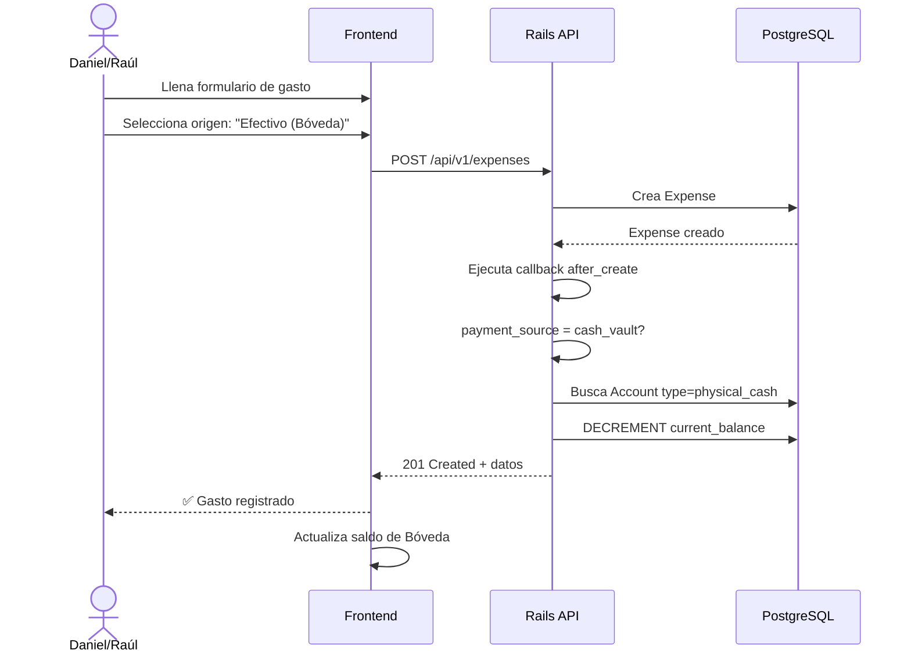

---

## 💳 Flujo: Registrar Gasto (Tarjeta Personal)

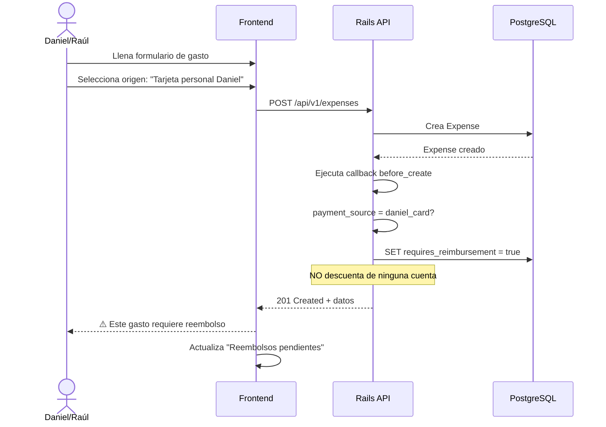

---

## 🔁 Flujo: Procesar Reembolso

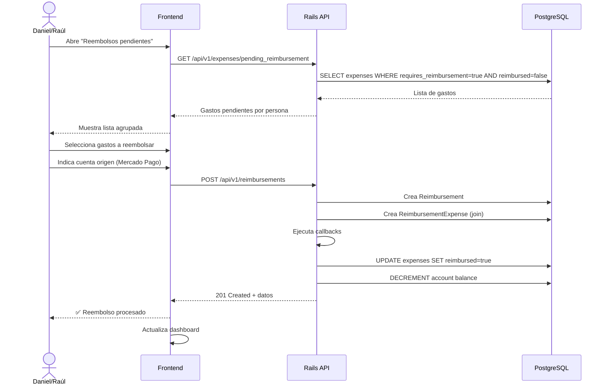

---

## 📊 Flujo: Ver Dashboard

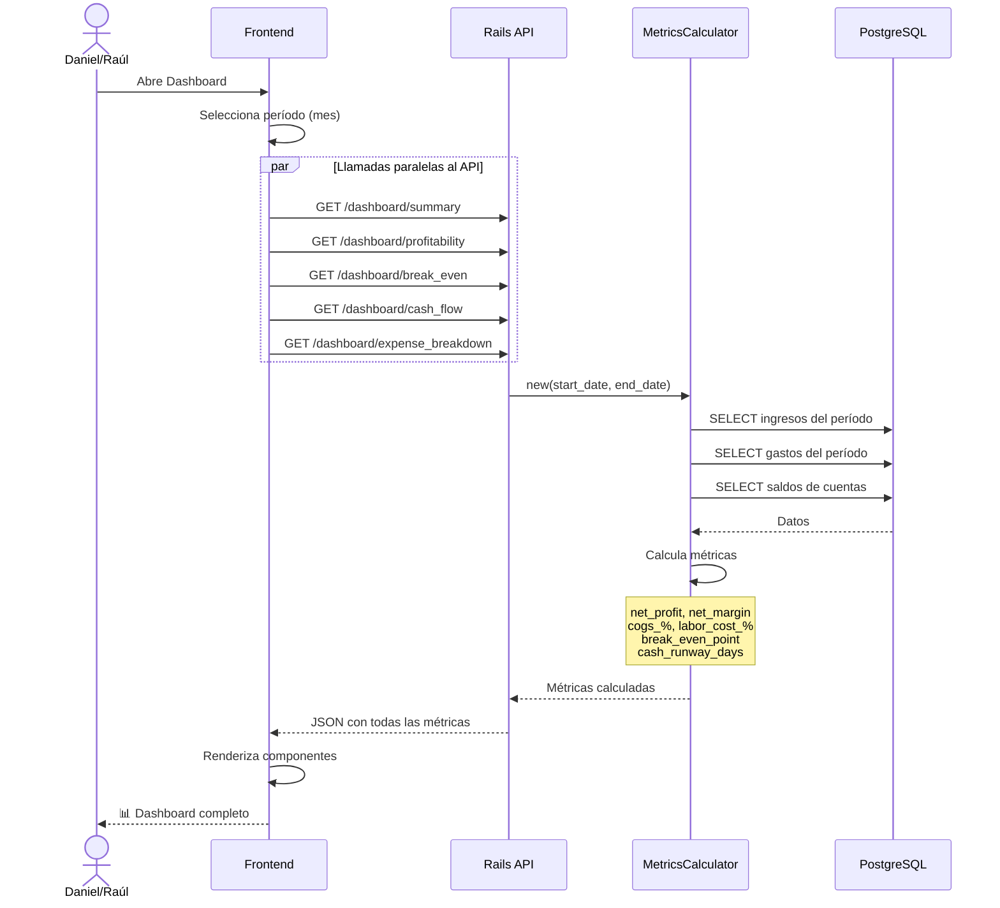

---

## 🏗️ Arquitectura del Sistema

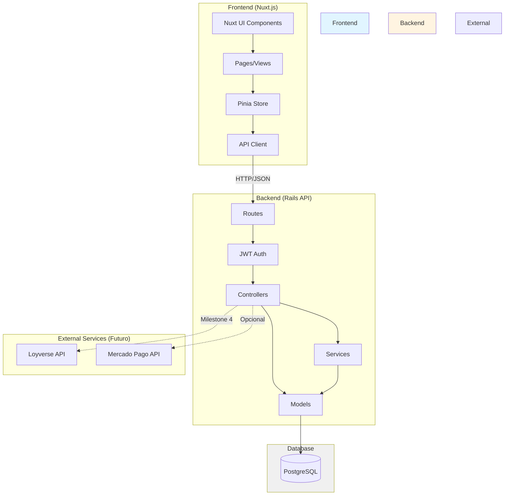

---

## 🎯 Módulos del Sistema (Por Milestone)

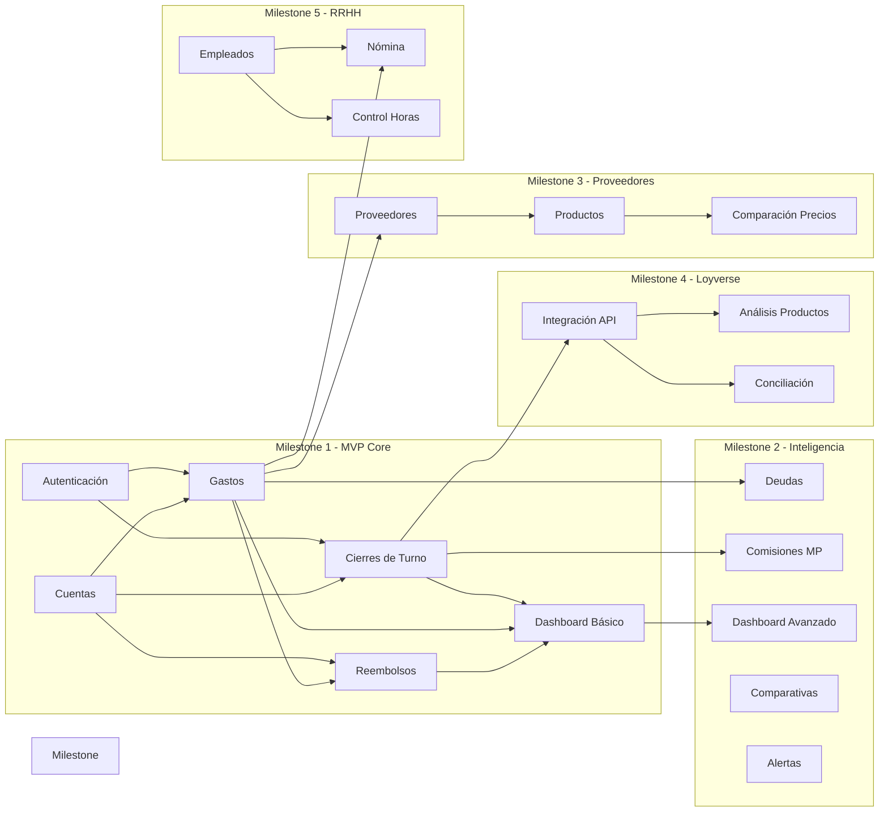

---

## 💰 Flujo de Dinero en el Sistema

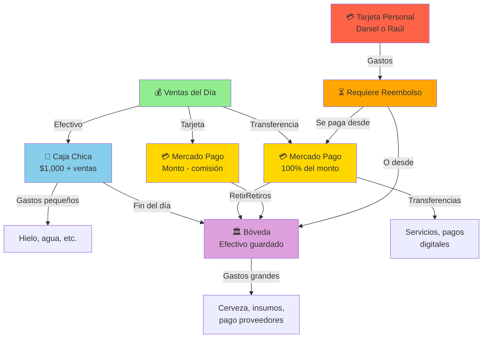

---

## 📈 Cálculo de Métricas (Flujo de MetricsCalculator)

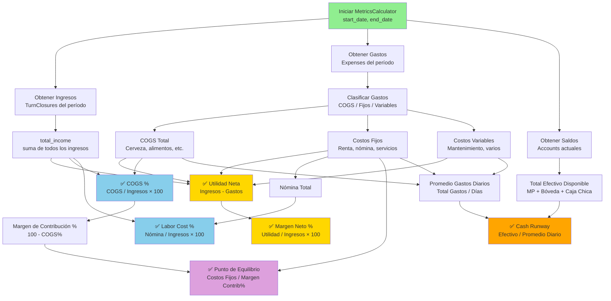

---

## 🎨 Estructura de Pantallas (Frontend)

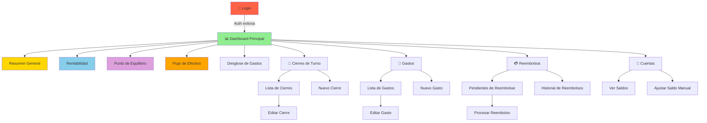

---

## 🔄 Ciclo de Vida de un Día Operativo

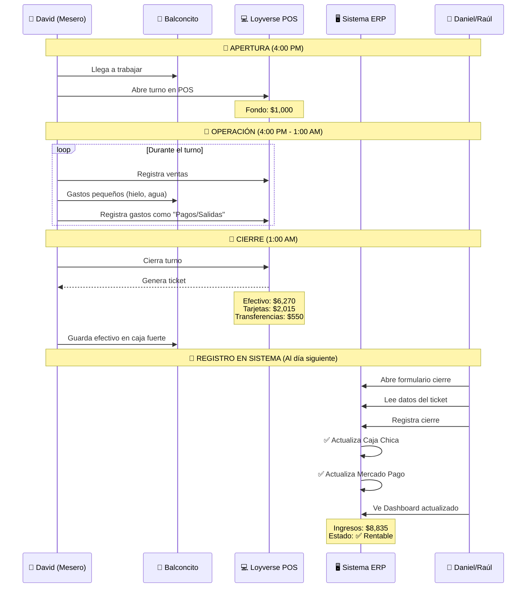

---

## 🚀 Roadmap Visual

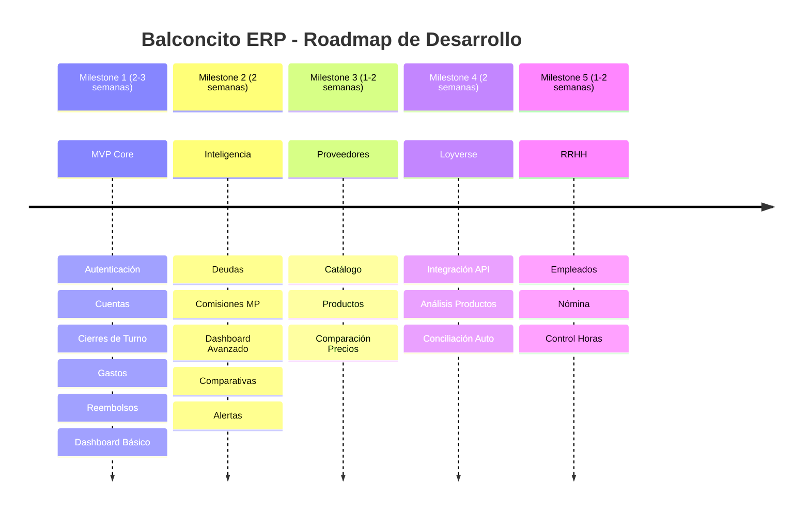

---

## 📱 Mockup del Dashboard (Concepto)

```
┌─────────────────────────────────────────────────────────────┐
│  🍺 BALCONCITO ERP                      👤 Daniel  🚪 Logout │
├─────────────────────────────────────────────────────────────┤
│                                                               │
│  📊 Dashboard - Noviembre 2024                 [▼ Este mes]  │
│                                                               │
│  ┌──────────────┐  ┌──────────────┐  ┌──────────────┐      │
│  │ 💰 INGRESOS  │  │ 💸 GASTOS    │  │ ✅ UTILIDAD  │      │
│  │              │  │              │  │              │      │
│  │  $150,000    │  │  $120,000    │  │  $30,000     │      │
│  │  ↑ 15%       │  │  ↑ 8%        │  │  ↑ 25%       │      │
│  └──────────────┘  └──────────────┘  └──────────────┘      │
│                                                               │
│  ┌─────────────────────────────────────────────────────────┐│
│  │ 📈 Métricas de Rentabilidad                             ││
│  │                                                          ││
│  │  Margen Neto: 20% ━━━━━━━━━━━━━━━━━━━━ 20%             ││
│  │  COGS: 30%        ━━━━━━━━━━ 30%        ✅ Saludable   ││
│  │  Nómina: 16.67%   ━━━━━━ 16.67%         ✅ Óptimo      ││
│  └─────────────────────────────────────────────────────────┘│
│                                                               │
│  ┌──────────────────────┐  ┌─────────────────────────────┐ │
│  │ ⚖️ Punto Equilibrio  │  │ 🏦 Saldos Actuales          │ │
│  │                      │  │                             │ │
│  │ Meta: $83,333        │  │ • Mercado Pago: $45,000     │ │
│  │ Actual: $150,000     │  │ • Bóveda: $20,000           │ │
│  │ ✅ $66,667 arriba    │  │ • Caja Chica: $3,000        │ │
│  │                      │  │ ━━━━━━━━━━━━━━━━━━━━━━━━━ │ │
│  │ Alcanzado: Día 16    │  │ TOTAL: $68,000              │ │
│  └──────────────────────┘  │                             │ │
│                             │ 💰 Cash Runway: 17 días ⚠️  │ │
│                             └─────────────────────────────┘ │
│                                                               │
│  ┌─────────────────────────────────────────────────────────┐│
│  │ 📊 Gastos por Categoría                                 ││
│  │                                                          ││
│  │  [Gráfica de dona]                                      ││
│  │                                                          ││
│  │  • Cerveza (20.83%) ━━━━━━━━━━━━ $25,000               ││
│  │  • Nómina (20.83%)  ━━━━━━━━━━━━ $25,000               ││
│  │  • Alimentos (12.5%) ━━━━━━ $15,000                    ││
│  │  • Otros (45.84%)    ━━━━━━━━━━━━━━━━━━━━ $55,000     ││
│  └─────────────────────────────────────────────────────────┘│
│                                                               │
└─────────────────────────────────────────────────────────────┘
```

---

Estos diagramas están en formato **Mermaid**, que es compatible con:
- GitHub (se renderizan automáticamente)
- GitLab
- VS Code (con extensión)
- Notion
- Obsidian
- Y muchos otros tools de documentación

Para verlos renderizados, puedes usar:
- https://mermaid.live/
- O simplemente subirlos a GitHub